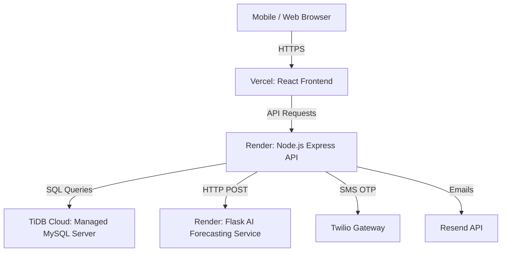

# 🚀 RaktSetu Deployment Guide
## Step-by-Step Production Deployment (100% Free Tier Stack)

This document provides a comprehensive, production-grade guide to deploying the entire **RaktSetu** ecosystem for free. 



---

## 🛠️ The Free Cloud Architecture

| Component | Platform | Free Tier Benefits |
| :--- | :--- | :--- |
| **MySQL Database** | [TiDB Cloud (Serverless)](https://tidbcloud.com/) or [Clever Cloud](https://www.clever-cloud.com/) | 5GB Storage, 100% MySQL compatible, highly available |
| **Node.js Backend** | [Render](https://render.com/) | Free web services (RAM 512MB), automatic Git deploys |
| **Python Flask AI Service** | [Render](https://render.com/) | Free Python runtime environment (RAM 512MB) |
| **React Frontend** | [Vercel](https://vercel.com/) or [Netlify](https://www.netlify.com/) | Zero-configuration React/Vite builds, globally fast CDN, SSL |

---

## 📂 Step 1: Set Up Your Managed MySQL Database (Free)

Since RaktSetu is built on MySQL, you need a cloud-hosted MySQL database.

### Option A: TiDB Cloud (Recommended - 5GB Free)
1. Sign up at [TiDB Cloud](https://tidbcloud.com/).
2. Create a free **Serverless Cluster**.
3. Under the **Connect** tab, select **Standard Connection** (MySQL Client).
4. Save your credentials:
   - **Host** (e.g., `gateway01.ap-southeast-1.prod.aws.tidbcloud.com`)
   - **Port**: `4000`
   - **User** (e.g., `xxxxxx.root`)
   - **Password** (your cluster password)
   - **Database Name**: `raktsetu`

### Option B: Clever Cloud (10MB Free - good for testing)
1. Sign up at [Clever Cloud](https://www.clever-cloud.com/).
2. Click **Add an Organization** -> **Add an Application** -> Select **Add an add-on** -> Select **MySQL**.
3. Select the free **Shared Plan (Dev)**.
4. Save your host, user, password, and database name.

### Initialize Database Schema
Run this command from your terminal to load the initial schema into your remote database:
```bash
mysql -h YOUR_REMOTE_HOST -u YOUR_REMOTE_USER -P YOUR_PORT -p YOUR_DATABASE_NAME < ./backend/models/schema.sql
```

---

## 🐍 Step 2: Deploy the Flask AI Forecasting Service (Free)

The AI Forecasting engine runs a Python Flask app utilizing the `Prophet` library.

1. Create a new GitHub repository specifically for the `/backend/ai` directory, OR keep it in your main monorepo structure.
2. Sign up on [Render](https://render.com/).
3. Click **New +** -> **Web Service**.
4. Connect your GitHub repository.
5. Configure the Web Service settings:
   - **Name**: `raktsetu-ai-service`
   - **Environment**: `Python`
   - **Build Command**: `pip install -r requirements.txt` (Render handles environment setup automatically)
   - **Start Command**: `gunicorn app:app` (Make sure to add `gunicorn` to your requirements.txt or install it)
   - **Root Directory**: `backend/ai` (if using a monorepo)
6. Add Environment Variables:
   - `PORT`: `10000` (Render defaults to routing port 10000)
   - `DB_HOST`: *[Your Cloud MySQL Host]*
   - `DB_PORT`: *[Your Cloud MySQL Port]*
   - `DB_USER`: *[Your Cloud MySQL Username]*
   - `DB_PASSWORD`: *[Your Cloud MySQL Password]*
   - `DB_NAME`: *[Your Cloud MySQL Database Name]*
7. Click **Create Web Service**.
8. Copy the generated service URL (e.g., `https://raktsetu-ai-service.onrender.com`). You will need this for the Node.js backend.

---

## ⚡ Step 3: Deploy the Node.js Express Backend (Free)

The backend handles the APIs, JWT authentication, Firebase operations, and communications.

1. Sign up on [Render](https://render.com/).
2. Click **New +** -> **Web Service**.
3. Connect your repository.
4. Configure settings:
   - **Name**: `raktsetu-backend`
   - **Language**: `Node`
   - **Root Directory**: `backend` (if using a monorepo)
   - **Build Command**: `npm install`
   - **Start Command**: `node server.js`
5. Click **Advanced** and add the following **Environment Variables**:

| Variable | Value | Description |
| :--- | :--- | :--- |
| `NODE_ENV` | `production` | Enables production mode optimizations |
| `PORT` | `10000` | Port handled by Render |
| `DB_HOST` | *[Your Cloud MySQL Host]* | Database Endpoint |
| `DB_PORT` | `3306` or `4000` | Database Port |
| `DB_USER` | *[Your Cloud MySQL User]* | Database Username |
| `DB_PASSWORD` | *[Your Cloud MySQL Password]* | Database Password |
| `DB_NAME` | `raktsetu` | Database Name |
| `JWT_SECRET` | *[Generate a 32-char string]* | Secret for Access Tokens |
| `JWT_REFRESH_SECRET` | *[Generate a 32-char string]* | Secret for Refresh Tokens |
| `JWT_OTP_SECRET` | *[Generate a 32-char string]* | Secret for Login OTPs |
| `CORS_ORIGIN` | `https://raktsetu-frontend.vercel.app` | **Your Vercel deployment URL** |
| `AI_SERVICE_URL` | `https://raktsetu-ai-service.onrender.com` | **Your AI service URL from Step 2** |
| `EMAIL_API_KEY` | *[Your Resend API Key]* | Get from [resend.com](https://resend.com) |
| `EMAIL_FROM_ADDRESS` | `onboarding@resend.dev` | Your verified domain email |
| `TWILIO_ACCOUNT_SID` | *[Your Twilio Account SID]* | For OTP (Optional) |
| `TWILIO_AUTH_TOKEN` | *[Your Twilio Auth Token]* | For OTP (Optional) |
| `TWILIO_PHONE_NUMBER` | *[Your Twilio Sender Number]* | For OTP (Optional) |

6. Click **Deploy Web Service**.
7. Copy the backend API URL (e.g., `https://raktsetu-backend.onrender.com`).

---

## 🎨 Step 4: Deploy the React Frontend (Free)

The frontend is built with React, Vite, and Tailwind CSS. Vercel is the recommended host for it.

### Configure Environment Variables
Inside your local `frontend` directory, ensure the production environment config variables point to your deployed backend API URL. Create/update a file named `.env.production` inside the `/frontend` directory:
```env
VITE_API_URL=https://raktsetu-backend.onrender.com/api/v1
VITE_API_BASE_URL=https://raktsetu-backend.onrender.com/api/v1
```

### Deploy to Vercel
1. Install the Vercel CLI locally (optional) or connect your repository on [vercel.com](https://vercel.com).
2. Connect your GitHub repository to Vercel.
3. Configure the project parameters:
   - **Framework Preset**: `Vite`
   - **Root Directory**: `frontend`
   - **Build Command**: `npm run build`
   - **Output Directory**: `dist`
4. Add the **Environment Variables** in the Vercel UI:
   - `VITE_API_URL`: `https://raktsetu-backend.onrender.com/api/v1`
   - `VITE_API_BASE_URL`: `https://raktsetu-backend.onrender.com/api/v1`
5. Click **Deploy**.
6. Vercel will build the frontend assets and provide you with a production URL (e.g., `https://raktsetu.vercel.app`).
7. **Important**: Go back to your Render backend configuration settings and update the `CORS_ORIGIN` variable to match your new production Vercel URL!

---

## 🛠️ Step 5: Third-Party Configurations

### 📧 Email (Resend)
* Sign up for a free account at [resend.com](https://resend.com).
* Generate an API Key under **API Keys**.
* Add it to the backend environment variables as `EMAIL_API_KEY`.
* By default, you can send test emails to your registered account using `onboarding@resend.dev`. To send emails to any recipient, add and verify your custom domain in Resend's settings.

### 📱 SMS OTP (Twilio - Optional)
* Create a free developer sandbox account at [twilio.com](https://www.twilio.com/).
* Retrieve your **Account SID**, **Auth Token**, and **Twilio Phone Number** from your dashboard console.
* Insert these credentials into the backend environment variables.
* Note: The backend will automatically fall back to logging OTP codes directly to the server logs/console for authentication if Twilio variables are omitted or invalid!

---

## 🔍 Step 6: Post-Deployment Verification Checklist

Once the deployment is complete, verify the services using the following checklist:

1. **Verify Backend Health**: 
   Navigate to `https://raktsetu-backend.onrender.com/api/v1/health` in your browser. It should respond with `{"status":"UP","database":"CONNECTED"}`.
2. **Verify AI Service Connection**:
   Check if the forecasting service responds to status checks.
3. **Register/Login Test**:
   Open your deployed frontend URL on your phone or computer. Go to the Hospital Register page and register a mock hospital. 
4. **Log in as System Admin**:
   Access the admin dashboard (`sysadmin@example.com` / `password123`) to approve the newly registered hospital, and check that live charts render correctly.
