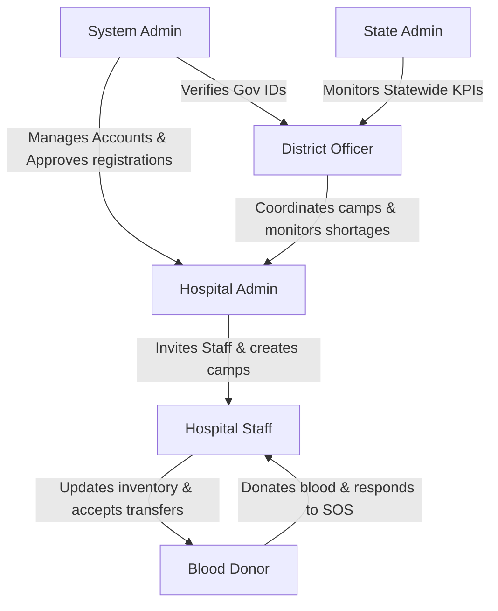

# 🩸 RaktSetu — Hospital Dashboard Codebase Scan & Architecture Audit Report

This report documents the architectural alignment, code errors ("bugs & errors"), and functional gaps found after scanning the `/Users/chinu/Developer/VS CODE NOT IMP/RaktSetu/raktsetu` folder.

---

## 📊 EXECUTIVE SUMMARY

RaktSetu (the "Blood Bridge") is designed as a secure, real-time, AI-driven blood matching and transfer system for hospitals, district officers, state authorities, and donors.

### Core Strengths
- **Beautiful & Modern UI**: Built with React + Vite, TailwindCSS, and Lucide React, featuring smooth animations (Framer Motion) and custom dashboard components.
- **Structured Routing**: Solid navigation skeleton using React Router DOM.
- **Robust Mock API**: Well-structured `mockApi.js` simulating network latency, handling database operations via `localStorage` states, and calculating dynamic expiration countdowns.

### Critical Gaps & Bugs
- ❌ **React Rules of Hooks Violation**: A critical conditional render bug in `HospitalLayout.jsx` that crashes/breaks React's rendering flow when users are unauthenticated.
- ❌ **51 ESLint Problems**: Unused imports, unused variables, and React Compiler compatibility warnings throughout almost every page.
- ❌ **Missing Emergency SOS UI**: The mock API supports emergency requests, and a toast notifies the user, but there is **no UI screen** to manage or dispatch blood for active emergency cases.
- ❌ **Hidden Analytics Charts**: The API fetches 7-day forecasts and supply-demand analytics, but no charting components or metrics dashboards are displayed.
- ❌ **Mock-Only Execution**: The app runs purely client-side without a persistent database, real spatial calculations, or regulatory integrations (e.g., *eRaktKosh*).

---

## 🛡️ RAKTSETU SYSTEM ARCHITECTURE & USER FLOW

RaktSetu operates on a **6-role hierarchy** to manage the entire lifecycle of blood donation and distribution. 

### 1. The 6 User Roles & Dashboard Access


| Role | Access Level | UI View Type | Description |
|---|---|---|---|
| 🩸 **Blood Donor** | Public (OTP/OAuth) | Mobile App / Donor Panel | Citizen willing to donate; completes eligibility screening. |
| 🏥 **Hospital Staff** | Invite-only | Staff Dashboard | Blood Bank Technician; inputs daily bags and logs expirations. |
| 🔧 **Hospital Admin** | Approved Registration | Admin Panel | Blood Bank Manager; controls staff, waste, and transfers. |
| 📊 **District Officer** | `.gov.in` Email + Call | District Heatmap | Govt Officer; coordinates camps and monitors region shortages. |
| 🏛️ **State Admin** | State Health Dept ID | State Dashboard | High-level officer; monitors cross-district transfers and KPIs. |
| ⚙️ **System Admin** | Superadmin console + MFA | Superadmin Console | Platform administrator; handles backups and system health. |

### 2. How the Current Subproject Fits the Flow
The current `raktsetu` folder represents the **Hospital Dashboard Portal** (specifically covering the **Hospital Staff** and **Hospital Admin** roles). It allows them to:
1. View live local blood bank levels.
2. Complete staff invitations and set passwords.
3. Manage peer-to-peer blood transfers.
4. Safely log expired blood bag disposals.

---

## 🐛 DETECTED BUGS & CODE ERRORS (The "Books & Errors")

Running `npm run lint` and inspecting files revealed **51 code issues (48 errors, 3 warnings)**:

### 1. Critical React Rules of Hooks Violation
> [!CAUTION]
> **File:** `HospitalLayout.jsx` ([L13-L21](file:///Users/chinu/Developer/VS%20CODE%20NOT%20IMP/RaktSetu/raktsetu/src/layout/HospitalLayout.jsx#L13-L21))
> React Hooks must be called in the exact same order on every component render. Currently, `useQuery` is called conditionally *after* an early return:
> ```javascript
> if (!isAuthenticated) {
>   return <Navigate to="/login" replace />; // Early return
> }
> 
> const { data: inventory = [] } = useQuery({ ... }); // Hook called conditionally!
> ```
> **Result**: If `isAuthenticated` changes, React's hook order is corrupted, throwing a runtime error.

#### **Remediation**:
Move the `useQuery` call *above* the early return, and use the `enabled` option to conditionally execute it:
```javascript
const { data: inventory = [] } = useQuery({
  queryKey: ['inventory'],
  queryFn: mockApi.getInventory,
  refetchInterval: 12000,
  enabled: isAuthenticated // Only fetch if the user is logged in
});

if (!isAuthenticated) {
  return <Navigate to="/login" replace />;
}
```

---

### 2. ESLint Unused Variables & Imports (48 Errors)
Multiple files import Lucide icons or React dependencies that are never rendered. This increases bundle size and triggers build warnings.

* **`Dashboard.jsx`**: `React` (L1), `Flame` (L12), and `Settings` (L19) are imported but never used.
* **`ExpiryAlerts.jsx`**: `React` (L1), `AlertTriangle` (L10), and `Clock` (L11) are unused.
* **`InviteToken.jsx`**: `Link` (L2), `Loader2` (L9), and `error` (L34) are unused.
* **`SetPassword.jsx`**: `Link` (L2) and `error` (L37, L60) are unused.
* **`BloodInventory.jsx`**: `Filter` (L13) is unused.
* **`UpdateStock.jsx`**: `HeartHandshake` (L12) is unused.
* **`TransferRequests.jsx`**: `AlertCircle` (L20) and `errors` (L52) are unused.

---

### 3. React Compiler Warnings (3 Warnings)
> [!WARNING]
> **Files:** `SetPassword.jsx` (L50) and `UpdateStock.jsx` (L41)
> React Compiler skipped memoization in these components because they use React Hook Form's `watch()` function:
> ```javascript
> const password = watch("password");
> const watchCollectionDate = watch('collectionDate');
> ```
> Using `watch()` forces the component to re-render on every keystroke, which breaks compiler optimizations. 
> *Fix*: Replace `watch()` with component-level state or use React Hook Form's `useWatch` hook to target specific inputs locally.

---

## 🚫 MISSING DATA & UI VIEWS (Needed but Unrepresentable)

There are several critical data arrays populated in `mockApi.js` that are **entirely missing** from the front-end user interface:

### 1. Emergency SOS Request Management
* **What is in `mockApi.js`**: `INITIAL_EMERGENCIES` stores active crash victim requests from nearby centers (e.g. *Holy Family Emergency Center* asking for 8 units of O-).
* **What the UI shows**: Nothing. The `Sidebar` and `App.jsx` have no route, page, or dashboard widget to let staff view, accept, decline, or dispatch blood bags for these emergency SOS cases. 
* **Hardcoded Badges**: In `HospitalLayout.jsx`, the emergency badge is hardcoded:
  ```javascript
  const badges = {
    expiry: expiryCount,
    emergency: 0 // Hardcoded to 0 instead of fetching mockApi.getEmergencyRequests()
  };
  ```

### 2. Live Forecasting & Usage Analytics
* **What is in `mockApi.js`**: `mockApi.getAnalytics()` returns four highly valuable datasets:
  1. `monthlyUsage` (Monthly blood usage vs collections)
  2. `bloodDemandByGroup` (Supply vs demand by blood type)
  3. `expiryTrend` (Wasted vs expired bags over time)
  4. `transferSuccessTrend` (P2P dispatch rate percentage)
* **What the UI shows**: None of this data is displayed. The hospital staff dashboard lacks any charts (`Chart.js` is installed but never used to render these curves), denying managers a way to visualize their AI demand forecast.

### 3. Settings & Staff Profiles
* **What is in `AuthContext.jsx`**: `DEFAULT_HOSPITAL` includes detailed metadata: License Number, Hospital Address, Contact Details, and Logo URL.
* **What the UI shows**: The logo and name are displayed at the bottom of the sidebar, but there is no Settings page or Profile view where these values can be updated.

---

## 🎯 PURPOSE ALIGNMENT & INACCURACIES

To serve as a production-grade healthcare product for Indian hospitals, the following core inaccuracies must be addressed:

### 1. Local Storage vs. Serverless DB
All database updates (adding stock, approving transfers) are persisted in `localStorage`. If a user clears their browser cache or switches devices, the hospital's entire blood bank inventory, transfers, and notifications are lost.

### 2. Simulated Geospatial Calculations
In `TransferRequests.jsx`, distance is simulated randomly:
```javascript
distance: parseFloat((Math.random() * 8 + 2).toFixed(1))
```
In a real emergency system, distance must be calculated using spatial querying (e.g. MongoDB `$near` or PostgreSQL PostGIS) based on the actual GPS coordinates of registered hospitals.

### 3. Regulatory Integration Gaps
* **No eRaktKosh Sync**: Under Indian NBTC guidelines, stock updates must sync with the national portal *eRaktKosh*. The dashboard does not include API hooks or queue handlers to sync this data.
* **No Biological Disposal Logs**: Expired batches are deleted from the array, but there is no regulatory logging detailing the biological method of waste disposal, as required by the Drugs & Cosmetics Act.

---

## 🛠️ RECOMMENDATIONS & REMEDIATION PLAN

To prepare the Hospital Dashboard for a live pilot, execute the following three steps:

### Phase 1: Resolve Critical Code Bugs
1. **Fix Rules of Hooks**: Update `HospitalLayout.jsx` to move the `useQuery` call before the early return.
2. **ESLint Cleanup**: Run code cleanup to strip unused variables and imports, preventing bundle bloat.
3. **Memoization Optimization**: Replace `watch()` with `useWatch` to restore React Compiler optimizations in form flows.

### Phase 2: Implement Missing UI Views
1. **Create Emergency SOS Page**: Add a route `/emergencies` and a card list page where staff can accept emergency requests and dispatch universal donor O- blood.
2. **Connect Emergency Badges**: Dynamically query `mockApi.getEmergencyRequests()` inside `HospitalLayout.jsx` and display the count.
3. **Build Analytics Dashboard**: Implement a `/analytics` tab using the pre-installed `react-chartjs-2` to chart supply-demand, usage trends, and waste rates.

### Phase 3: Move to a Cloud Backend
1. Migrate the mock API data arrays to a hosted database (such as Firebase Firestore, Supabase, or MongoDB).
2. Replace local shims with real distance formulas using Google Maps or OpenStreetMap APIs.
