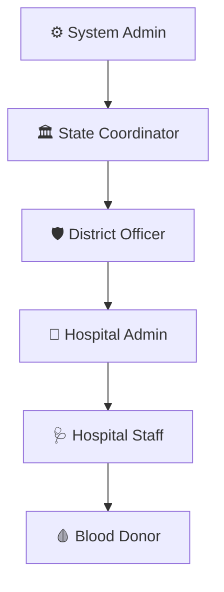

# 📋 RaktSetu — User Roles, Purposes & Responsibilities

This guide provides a comprehensive breakdown of the **purpose, responsibilities, access scopes, and features** for each of the 6 user roles in the **RaktSetu Blood Supply Chain Management Platform**.

---

## 🗺️ System Overview Hierarchy

---

## 👥 Role Profiles & Detail

### 1. ⚙️ System Admin (Root Operator)
* **Purpose**: Infrastructure administrator responsible for verifying entities, managing global settings, and maintaining audit compliance across the platform.
* **Access Scope**: System-wide read/write permissions.
* **Key Responsibilities**:
  * **Hospital Applications**: Review, approve, or reject new hospital registrations.
  * **District Officer Registrations**: Approve pending credentials of regional officers.
  * **Audit Compliance**: Access and query the platform's audit trail to log user sessions, actions, IP addresses, and event severities.
  * **System Configurations**: Enable or disable system-wide flags, database maintenance, and security rules.

---

### 2. 🏛️ State Coordinator (State Admin)
* **Purpose**: Policy-level health authority monitoring state-wide blood resources, waste KPIs, and strategic funding allocations.
* **Access Scope**: Read/write access at the state level (aggregate data).
* **Key Responsibilities**:
  * **Cross-District Transfers**: Approve and authorize the movement of blood bags between different districts.
  * **Waste KPIs**: Review state-wide metrics detailing discarded, expired, or spoiled blood units.
  * **District Officer Reports**: Analyze regional reports detailing shortages or surplus trends.
  * **Funding Recommendations**: Review AI-driven funding allocations for upgrading cold storage equipment in needy areas.
  * **State Policy Alerts**: Dispatch state-level advisories and policy changes to all district officers.

---

### 3. 🛡️ District Officer (Regional Coordinator)
* **Purpose**: Regional coordinator supervising the hospital registry and managing local camps and alert systems within their district.
* **Access Scope**: Read/write access restricted to their assigned district.
* **Key Responsibilities**:
  * **Hospital Registry**: Monitor verified and pending hospitals in their district.
  * **Camp Approvals**: Review and approve public blood donation camp schedules.
  * **District Alerts**: Issue emergency broadcast alerts to hospitals and donors in the district during local crises.
  * **District Reports**: Track regional supply indices and demand trends.

---

### 4. 🏥 Hospital Admin (Director / Manager)
* **Purpose**: Hospital manager responsible for strategic planning, staffing, and threshold settings for the hospital's blood bank.
* **Access Scope**: Read/write access limited to their specific hospital.
* **Key Responsibilities**:
  * **Staff Management**: Invite new medical staff and manage user permissions.
  * **Alert Thresholds**: Configure customized minimum/maximum stock levels and expiration alert timings.
  * **AI Demand Forecast**: Analyze Prophet-based forecasts of future blood group demand to plan collection drives.
  * **Waste Analytics**: Audit local blood bag discards to improve cold chain compliance.
  * **Hospital Profile**: Update contact, address, and license data.

---

### 5. 🩺 Hospital Staff (Technician / Receptionist)
* **Purpose**: Daily operations coordinator logging collections, managing inventory, and handling emergency requests.
* **Access Scope**: Operational read/write access limited to their specific hospital.
* **Key Responsibilities**:
  * **Inventory Management**: Add, update, or expire blood bags (tracking units, group, collection date).
  * **Transfer Requests**: Initiate and fulfill local blood bag transfers to other nearby hospitals in the district.
  * **Surgical Demand**: Log upcoming surgeries to reserve units and avoid shortages.
  * **Donor Search**: Search for qualified local donors and request emergency donations.

---

### 6. 🩸 Blood Donor (Public User)
* **Purpose**: The source of blood supply, helping meet community demands during emergency and scheduled campaigns.
* **Access Scope**: Restricted to personal profile, public search widgets, and camp maps.
* **Key Responsibilities**:
  * **Stock Availability Check**: Search for live blood group stocks across nearby hospitals.
  * **Donation Camps**: Locate nearby donation drives and camp schedules.
  * **Pledge Donations**: Opt-in to receive emergency SMS/email notifications when their blood group matches a critical local request.
  * **Health Stats**: Log and monitor their donor parameters (Age, Weight, Last Donation, and Chronic Illness history).
