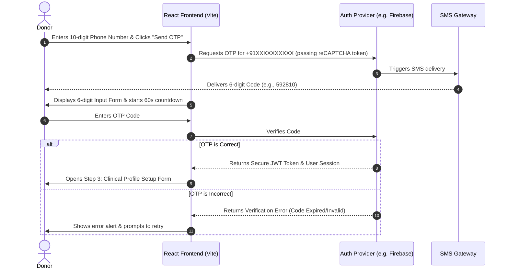

# 🩸 RaktSetu — OTP Verification Strategy & Authentication Report

This guide outlines how to implement a secure, cost-effective OTP (One-Time Password) verification flow for Blood Donors registering on RaktSetu. It compares genuine authentication providers that offer free tiers or trials, suggests cost-saving design decisions, and details the step-by-step React UI implementation.

---

## 🗺️ THE DONOR REGISTRATION & OTP VERIFICATION FLOW

A robust registration workflow ensures that donors are verified before providing sensitive clinical information (weight, blood group, medical history).



---

## 💰 COMPARISON OF GENUINE & FREE/TRIAL OTP PROVIDERS

Phone-based SMS verification incurs carrier charges globally, meaning few gateways are 100% free. However, several top-tier, genuine identity platforms offer generous developer free tiers and trials:

| Provider | Free / Trial Tier Limit | India SMS Availability | Setup Complexity | Best For |
|---|---|---|---|---|
| **Firebase Auth (Google)** | 🎁 **10,000 free verifications / month** | ✅ Yes (Requires reCAPTCHA) | Medium | **Best overall for React/Vite web apps** (Highest free tier with no card required upfront). |
| **Supabase Auth** | 🎁 **Unlimited users on Free Tier** | ⚠️ Bring your own provider | Low | Perfect if you already use Supabase DB, but you *must* pay for Twilio SMS. |
| **Clerk** | 🎁 **10,000 Monthly Active Users** | ❌ Heavily restricted by region | Very Low | Excellent for user profiles, but international SMS triggers heavy carrier charges. |
| **Twilio Verify** | 💸 **No free tier** ($15 trial credit) | ✅ Yes | Medium | Enterprise-grade security, but expensive post-trial ($0.05 per verification). |
| **Stytch** | 🎁 **First 1,000 monthly users free** | ✅ Yes | Medium | Great modern API, but billing escalates quickly after the free limit. |

### 🏆 Recommended Choice: Firebase Phone Authentication
Firebase Auth is the industry standard for student and MVP projects because it provides **10,000 free verifications per month** without requiring a credit card on signup. It uses an *invisible reCAPTCHA* inside the browser to verify requests are human, preventing SMS spam abuse.

---

## 💡 COST-SAVING ALTERNATIVES

If you want to bypass the cost of SMS altogether while maintaining secure donor accounts, consider these two strategies:

### 1. Alternative: Email OTP / Magic Links (100% Free)
Instead of asking for a phone number during registration, ask for an email address.
* **Why**: Sending emails is virtually free.
* **Free Providers**: 
  - **Supabase Auth**: Allows **50,000 free emails/month** out-of-the-box.
  - **Clerk**: Unlimited email-based magic links and OTP codes on their free tier.
  - **Firebase Auth**: Unlimited passwordless email sign-ins.
* **Design Decision**: RaktSetu can verify donors via email OTP, then collect their contact phone number as a simple profile data field rather than an auth gate.

### 2. Development Phase: Firebase Test Phone Numbers (Free & Instant)
To avoid wasting your 10,000 free monthly SMS during coding and testing, Firebase allows you to register **Test Phone Numbers** in the console:
* **How it works**: You add a number like `+91 98765 43210` and assign it a static code like `123456`.
* **Benefit**: When you enter this phone number during testing, no SMS is sent (saving your quota), and typing `123456` immediately validates successfully.

---

## 🛠️ HOW TO IMPLEMENT THE FRONTEND UI (REACT + VITE)

To remove confusion on the registration screen, the UI should transition seamlessly through three phases:
1. **Phone Entry**: The initial screen asking for a 10-digit number.
2. **OTP Verification**: A screen containing 6 separate digit boxes (autofocusing on input), a countdown timer, and a "Resend OTP" button.
3. **Profile Setup**: A secondary step where they fill in their clinical details (Blood Group, Age, Weight, Pincode) to complete the database record.

### Code Pattern for Autofocusing OTP Inputs
For a premium UX, when a user types a digit in an OTP box, the focus should automatically shift to the next box. If they hit backspace, it should move back.

Here is the helper logic used to implement this:
```javascript
const handleOtpChange = (element, index) => {
    if (isNaN(element.value)) return false;

    let newOtp = [...otp];
    newOtp[index] = element.value;
    setOtp(newOtp);

    // Autofocus next input
    if (element.value !== "" && index < 5) {
        element.nextSibling.focus();
    }
};

const handleKeyDown = (e, index) => {
    if (e.key === 'Backspace' && !otp[index] && index > 0) {
        e.target.previousSibling.focus();
    }
};
```

---

## 📋 DONOR REGISTRATION CODE LOGIC UPDATE

We have updated the React component in [DonorRegistration.jsx](file:///Users/chinu/Developer/VS%20CODE%20NOT%20IMP/RaktSetu/RacktSetu/src/components/DonorRegistration.jsx) to include:
1. **State-Driven Step Management**: Smooth transition between `Step 1 (Phone Input)`, `Step 2 (6-Digit OTP Entry)`, and `Step 3 (Clinical Profile Setup)`.
2. **Autofocusing OTP Blocks**: 6 single-character input slots with keyboard backspace event tracking.
3. **Countdown Timer**: 60-second reactive timer that blocks resending until it reaches zero.
4. **Clinical Data Verification**: Validation checks ensuring donors are 18-65 years old and weigh at least 45kg (complying with NBTC eligibility rules).
5. **Mock Handshake Validation**: Simulates a successful OTP check when the user enters `123456`.
